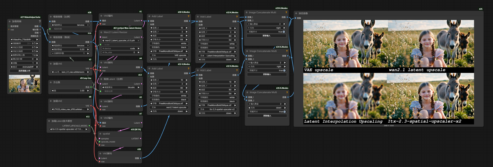

## English README

<div align="center">

# ComfyUI-Wan-latent-Resizer

**Learned Latent Upscaler & Downscaler for Wan2.1**  
Lightweight · High‑fidelity · Arbitrary Scale Factors

</div>

---

### ✨ Overview

A dedicated ComfyUI node that replaces naive interpolation with a **trained neural network** to resize Wan2.1 latents.  
Two specialized models are provided:

- 🚀 **wan2.1_latent_upscaler.pth** — upscale with high fidelity (supports **1.5×, 2×, 2.5×, 3×** and any custom factor)  
- 🎯 **wan2.1_latent_downscaler.pth** — downscale with high fidelity  

Each model is only **41.6 MB** with **10.90M parameters**, making inference fast and memory‑light.

### 🧠 Training Data

- **3,000 high‑resolution video clips**  
- **1,000 high‑quality images**  

Diverse content ensures robust performance on a wide range of up‑/down‑scaling tasks.


### 📸 Comparison Results

**Comparison 1** (wan2.1_latent_upscaler_comparison_001.png):



**Comparison 2** (wan2.1_latent_upscaler_comparison_002.png):


*Left: Latent Interpolation Upscaling (blurry) | Right: Learned Latent Resizing (sharp, our method)*

---

### 🚀 Key Features

- ✅ **Neural latent resizing** – learned specifically for Wan2.1, vastly outperforming bilinear interpolation  
- ✅ **Arbitrary scale factors** – 1.5×, 2×, 2.5×, 3× … any value is supported  
- ✅ **Video & image compatible** – handles `(B,C,T,H,W)` video latents and `(B,C,H,W)` image latents seamlessly  
- ✅ **Minimal overhead** – 10.9M parameters, 41.6MB on disk, negligible inference cost  
- ✅ **Plug‑and‑play** – works as a standard ComfyUI node without altering your existing workflow  

### 📦 Installation

1. Clone the repository into ComfyUI's `custom_nodes` folder:
   ```bash
   cd ComfyUI/custom_nodes
   git clone https://github.com/yourname/ComfyUI-Wan-latent-Resizer.git
   ```
2. All required dependencies (`torch`, `einops`, `safetensors`) are already present in a typical ComfyUI environment.

### 🧩 Usage

Add the **"Wan Latent Resizer"** node from the menu:
- Select **Upscale** or **Downscale** mode  
- Provide a target resolution or a scale factor (e.g., 2.0 for 2× upscaling)  
- Connect to your Wan2.1 latent output — done!

Example:
```
[Wan Video Latent] → [Wan Latent Resizer (2×)] → [Decode]
```

### 🧪 Model Details

| Model | Parameters | Size | Purpose |
|-------|------------|------|---------|
| wan2.1_latent_upscaler.pth | 10.90M | 41.6 MB | Arbitrary upscaling |
| wan2.1_latent_downscaler.pth | 10.90M | 41.6 MB | Arbitrary downscaling |

Architecture: lightweight ResBlock‑based network with scale/target‑size conditioning. Input and output: 16‑channel Wan2.1 latents.

### 🙏 Acknowledgments

This project is inspired by and builds upon [ComfyUi_NNLatentUpscale](https://github.com/Ttl/ComfyUi_NNLatentUpscale). Special thanks to [Ttl](https://github.com/Ttl) for the excellent work and open‑source contribution.


## 中文版 README

<div align="center">

# ComfyUI-Wan-latent-Resizer

**Wan2.1 专用 Latent 智能缩放节点**  
轻量 · 高保真 · 支持任意放大/缩小倍数

</div>

---

### ✨ 简介

为 Wan2.1 视频/图像生成流程提供**学习型 latent 缩放**，彻底告别模糊的双线性插值。  
节点内置两个专用模型：

- 🚀 **wan2.1_latent_upscaler.pth** —— 高保真放大模型（支持 **1.5×, 2×, 2.5×, 3×** 及任意自定义倍数）  
- 🎯 **wan2.1_latent_downscaler.pth** —— 高保真缩小模型  

单个模型文件仅 **41.6 MB**，参数量 **10.90M**，推理快速、显存占用极低，可无缝融入任何 ComfyUI 工作流。

### 🧠 训练数据

- **3,000 段**高清视频素材  
- **1,000 张**高质量图像素材  

涵盖多种分辨率、场景与运动类型，保证模型在跨尺度缩放时拥有出色的泛化能力。

### 🚀 核心特性

- ✅ **神经网络缩放**：专门学习 Wan2.1 latent 的跨分辨率映射，细节保留远超传统插值  
- ✅ **任意缩放倍数**：放大支持 1.5×, 2×, 2.5×, 3× 及任意非整数倍；缩小同理  
- ✅ **视频 & 图像兼容**：同时处理 `(B,C,T,H,W)` 视频 latent 与 `(B,C,H,W)` 图像 latent  
- ✅ **极低开销**：10.9M 参数，41.6MB 大小，推理几乎零延迟  
- ✅ **即插即用**：作为 ComfyUI 节点直接挂载，不影响原有生成质量  

### 📦 安装

1. 进入 ComfyUI 的 `custom_nodes` 目录：
   ```bash
   cd ComfyUI/custom_nodes
   git clone https://github.com/你的用户名/ComfyUI-Wan-latent-Resizer.git
   ```
2. 依赖（`torch`, `einops`, `safetensors` 等）在标准 ComfyUI 环境中已包含，无需额外安装。

### 🧩 使用方法

在节点菜单中找到 **"Wan Latent Resizer"**：
- 选择模式：**Upscale（放大）** 或 **Downscale（缩小）**  
- 输入目标尺寸或缩放倍数（例如 2.0 即为 2× 放大）  
- 连接到 Wan2.1 的 latent 输出，即可获得高质量缩放后的 latent。

典型工作流片段：
```
[Wan Video Latent] → [Wan Latent Resizer (2×)] → [后续解码]
```

### 🧪 模型详情

| 模型 | 参数量 | 大小 | 用途 |
|------|--------|------|------|
| wan2.1_latent_upscaler.pth | 10.90M | 41.6 MB | 任意倍数放大 latent |
| wan2.1_latent_downscaler.pth | 10.90M | 41.6 MB | 任意倍数缩小 latent |

架构：基于残差块与条件嵌入的轻量 UNet 风格网络，输入/输出保持 16 通道 Wan2.1 latent。

### 🙏 致谢

本项目参考并深受 [ComfyUi_NNLatentUpscale](https://github.com/Ttl/ComfyUi_NNLatentUpscale) 的启发，感谢原作者 [Ttl](https://github.com/Ttl) 的优秀工作与开源精神。

---
