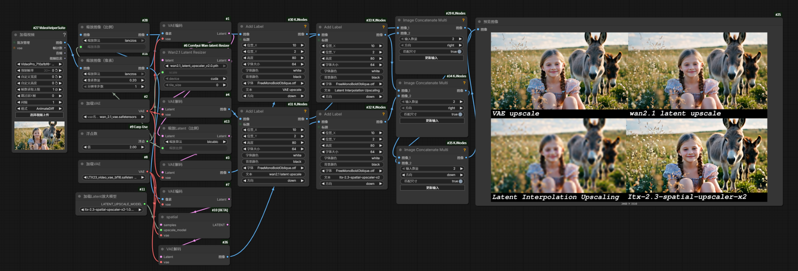

## English README

<div align="center">

# ComfyUI-Wan-latent-Resizer

**Learned Latent Upscaler & Downscaler for Wan2.1**  
Lightweight · High‑fidelity · Arbitrary Scale Factors

</div>

---

### ✨ Overview

A dedicated ComfyUI node that replaces naive interpolation with a trained neural network to resize Wan2.1 latents. The node includes the following specialized models:

- 🚀 wan2.1_latent_upscaler.pth — High-fidelity upscaling model, supports 1.5×, 2×, 2.5×, 3× and any custom factor
- 🎯 wan2.1_latent_downscaler.pth — High-fidelity downscaling model
- 🆕 wan2.1_latent_upscaler_v2.0.pth — Second-generation high-fidelity upscaling model, supports 1.25× – 10× continuous arbitrary scaling

Each model is only 41.6 MB with 10.90M parameters, making inference fast and memory-light.


### 🧠 Training Data

- 3,000 high-resolution video clips
- 1,000 high-quality images

Diverse content ensures robust performance on a wide range of upscaling and downscaling tasks.


### 📸 Comparison Results

**Comparison 1 (wan2.1_latent_upscaler_comparison_001.png):**



**Comparison 2 (wan2.1_latent_upscaler_comparison_002.png):**


**Comparison 3 (wan2.1_latent_upscaler_comparison_003.mp4):**

<video controls src="examples/wan2.1_latent_upscaler_comparison_003.mp4"></video>

Left: Latent Interpolation Upscaling (blurry) | Right: Learned Latent Resizing (sharp, our method)


### 🚀 Key Features

- ✅ Neural latent resizing: learned specifically for Wan2.1, vastly outperforming bilinear interpolation
- ✅ Arbitrary scale factors: v1.0 supports 1.5×, 2×, 2.5×, 3×, etc.; v2.0 supports 1.25× – 10× continuous arbitrary scaling
- ✅ Video & image compatible: seamlessly handles (B,C,T,H,W) video latents and (B,C,H,W) image latents
- ✅ Minimal overhead: 10.9M parameters, 41.6MB on disk, negligible inference cost
- ✅ Plug-and-play: works as a standard ComfyUI node without altering your existing workflow


### 📦 Installation

1. Clone the repository into ComfyUI's custom_nodes folder:

```bash
cd ComfyUI/custom_nodes
git clone https://github.com/LBH-123-AI/ComfyUI-Wan-latent-Resizer.git
```

2. All required dependencies (torch, einops, safetensors) are already present in a typical ComfyUI environment.


### 🧩 Usage

Add the "Wan Latent Resizer" node from the menu:
- Select Upscale or Downscale mode
- Provide a target resolution or a scale factor (e.g., 2.0 for 2× upscaling)
- Connect to your Wan2.1 latent output — done!

**Typical workflow examples:**

**Workflow 1: Direct Upscale & Decode (Not Recommended)**  
[Wan Video Latent] → [Wan Latent Resizer (2×)] → [Decode]  
Suitable for quick output scenarios, directly upscales latent then decodes.

**Workflow 2: Low-res Generation → Upscale → High-res Refinement → Decode (Recommended)**  
[Low-res Video Latent] → [Wan Latent Resizer (2×)] → [High-res Refinement] → [Decode]  
First generate a base latent at lower resolution for speed, upscale it through this node, then feed into a refinement module for high-resolution detail restoration, and finally decode. This workflow significantly reduces VRAM usage and generation time while ensuring superior output quality.


### 🧪 Model Details

| Model                              | Parameters | Size    | Purpose                              |
|------------------------------------|------------|---------|--------------------------------------|
| wan2.1_latent_upscaler.pth         | 10.90M     | 41.6 MB | Arbitrary upscaling (v1.0)           |
| wan2.1_latent_downscaler.pth       | 10.90M     | 41.6 MB | Arbitrary downscaling                |
| wan2.1_latent_upscaler_v2.0.pth 🆕 | 10.90M     | 41.6 MB | Continuous arbitrary upscaling (v2.0)|

Architecture: Lightweight ResBlock-based network with scale/target-size conditioning. Input and output: 16-channel Wan2.1 latents.


### 🆕 Changelog

**📝 Performance Validation (v2.0)**  
Validated on 4,275 samples, Val Loss = 0.0899 (60% reduction vs. bilinear interpolation baseline).

**📝 Training Curve (v2.0)**

| Epoch | Val Loss | Reduction (cumulative) |
|-------|----------|-------------------------|
| 0     | 0.22402  | -                       |
| 5     | 0.13287  | 40.7%                   |
| 10    | 0.11247  | 49.8%                   |
| 14    | 0.10250  | 54.2%                   |
| 17    | 0.09737  | 56.5%                   |
| 19    | 0.09458  | 57.8%                   |
| 21    | 0.09312  | 58.4%                   |
| 24    | 0.09102  | 59.4%                   |
| 26    | 0.09030  | 59.7%                   |
| 28    | 0.09007  | 59.8%                   |
| 29    | 0.08987  | 60.0%                   |

**📝 v1.0 vs v2.0 Comparison**

| Feature              | v1.0                 | v2.0                 |
|----------------------|----------------------|----------------------|
| Scale support        | Discrete             | Continuous           |
| Range                | 1.5× – 3×            | 1.25× – 10×          |
| Custom factor        | Limited              | Any value            |
| Training samples     | 4,000                | 4,275                |
| Training strategy    | Single-scale         | Multi-scale + multi-frame |
| Generalization       | Moderate             | Excellent            |
| Val Loss             | 0.09305              | 0.08987              |

**📝 Version History**

| Version    | Scale Support        | Notes                                                        |
|------------|----------------------|--------------------------------------------------------------|
| v1.0       | 1.5×, 2×, 2.5×, 3×   | Initial release                                              |
| v2.0 🆕    | 1.25× – 10×          | Significantly extended range, greatly improved generalization, supports continuous arbitrary scaling |


### 🙏 Acknowledgments

This project is inspired by and builds upon ComfyUi_NNLatentUpscale (https://github.com/Ttl/ComfyUi_NNLatentUpscale). Special thanks to Ttl (https://github.com/Ttl) for the excellent work and open-source contribution.


## 中文版 README

<div align="center">

# ComfyUI-Wan-latent-Resizer

**Wan2.1 专用 Latent 智能缩放节点**  
轻量 · 高保真 · 支持任意放大/缩小倍数

</div>

---

### ✨ 简介

为 Wan2.1 视频/图像生成流程提供一个专用的 ComfyUI 节点，用训练好的神经网络替代简单的插值算法来完成 latent 缩放。节点内置以下专用模型：

- 🚀 wan2.1_latent_upscaler.pth —— 高保真放大模型，支持 1.5×、2×、2.5×、3× 及任意自定义倍数
- 🎯 wan2.1_latent_downscaler.pth —— 高保真缩小模型
- 🆕 wan2.1_latent_upscaler_v2.0.pth —— 第二代高保真放大模型，支持 1.25× – 10× 连续任意倍数

单个模型文件仅 41.6 MB，参数量 10.90M，推理速度快、内存占用极低。


### 🧠 训练数据

- 3,000 段高清视频素材
- 1,000 张高质量图像素材

多样化的内容确保了模型在各种放大/缩小任务上都有稳健的表现。


### 📸 对比效果

**对比示例 1（wan2.1_latent_upscaler_comparison_001.png）：**


**对比示例 2（wan2.1_latent_upscaler_comparison_002.png）：**


**对比示例 3（wan2.1_latent_upscaler_comparison_003.mp4）：**

<video controls src="examples/wan2.1_latent_upscaler_comparison_003.mp4"></video>

左：Latent 插值放大（画面模糊） | 右：学习型 Latent 缩放（画面清晰，即本方法）


### 🚀 核心特性

- ✅ 神经网络 latent 缩放：专门针对 Wan2.1 学习，大幅优于双线性插值
- ✅ 任意缩放倍数：v1.0 支持 1.5×、2×、2.5×、3× 等；v2.0 支持 1.25× – 10× 连续任意倍数
- ✅ 视频 & 图像兼容：无缝处理 (B,C,T,H,W) 视频 latent 和 (B,C,H,W) 图像 latent
- ✅ 极低开销：10.9M 参数，41.6MB 磁盘占用，推理开销可忽略不计
- ✅ 即插即用：作为标准 ComfyUI 节点工作，不改变现有工作流


### 📦 安装

1. 将仓库克隆到 ComfyUI 的 custom_nodes 文件夹：

```bash
cd ComfyUI/custom_nodes
git clone https://github.com/LBH-123-AI/ComfyUI-Wan-latent-Resizer.git
```

2. 所有必需的依赖（torch、einops、safetensors）在标准 ComfyUI 环境中已自带。


### 🧩 使用方法

从节点菜单中添加 "Wan Latent Resizer"：
- 选择 Upscale（放大）或 Downscale（缩小）模式
- 提供目标分辨率或缩放倍数（例如 2.0 表示 2× 放大）
- 连接到 Wan2.1 的 latent 输出即可

**典型流程示例：**

**方案一：直接放大解码（不推荐）**  
[Wan Video Latent] → [Wan Latent Resizer (2×)] → [解码]  
适用于快速出图场景，直接对 latent 放大后解码。

**方案二：低清生成 → 放大 → 高清重绘 → 解码（推荐）**  
[低清 Video Latent] → [Wan Latent Resizer (2×)] → [高清重绘] → [解码]  
先以较低分辨率快速生成基础 latent，经本节点放大后送入重绘模块进行高清细节修复，最终解码输出。该流程在保证画面质量的同时显著降低显存占用和生成时间。


### 🧪 模型详情

| 模型                               | 参数量  | 大小    | 用途                     |
|------------------------------------|---------|---------|--------------------------|
| wan2.1_latent_upscaler.pth         | 10.90M  | 41.6 MB | 任意倍数放大（v1.0）     |
| wan2.1_latent_downscaler.pth       | 10.90M  | 41.6 MB | 任意倍数缩小             |
| wan2.1_latent_upscaler_v2.0.pth 🆕 | 10.90M  | 41.6 MB | 连续任意倍数放大（v2.0） |

架构：基于残差块的轻量网络，带有缩放倍数/目标尺寸条件输入。输入和输出均为 16 通道 Wan2.1 latent。


### 🆕 更新日志

**📝 性能验证（v2.0）**  
在 4,275 个样本上验证，Val Loss = 0.0899（相比双线性插值基线下降 60%）。

**📝 训练曲线（v2.0）**

| Epoch | Val Loss | 累计降幅 |
|-------|----------|----------|
| 0     | 0.22402  | -        |
| 5     | 0.13287  | 40.7%    |
| 10    | 0.11247  | 49.8%    |
| 14    | 0.10250  | 54.2%    |
| 17    | 0.09737  | 56.5%    |
| 19    | 0.09458  | 57.8%    |
| 21    | 0.09312  | 58.4%    |
| 24    | 0.09102  | 59.4%    |
| 26    | 0.09030  | 59.7%    |
| 28    | 0.09007  | 59.8%    |
| 29    | 0.08987  | 60.0%    |

**📝 v1.0 与 v2.0 对比**

| 特性               | v1.0              | v2.0              |
|--------------------|-------------------|-------------------|
| 缩放支持           | 离散固定倍数      | 连续任意倍数      |
| 倍率范围           | 1.5× – 3×         | 1.25× – 10×       |
| 自定义倍数         | 有限              | 任意数值          |
| 训练样本           | 4,000             | 4,275             |
| 训练策略           | 单尺度            | 多尺度 + 多帧     |
| 泛化能力           | 中等              | 优秀              |
| Val Loss           | 0.09305           | 0.08987           |

**📝 版本历史**

| 版本     | 支持倍数               | 更新说明                                                       |
|----------|------------------------|----------------------------------------------------------------|
| v1.0     | 1.5×, 2×, 2.5×, 3×     | 初始版本                                                       |
| v2.0 🆕  | 1.25× – 10×            | 范围大幅扩展，泛化能力显著提升，支持连续任意倍数               |


### 🙏 致谢

本项目受 ComfyUi_NNLatentUpscale（https://github.com/Ttl/ComfyUi_NNLatentUpscale）启发并基于其构建，特别感谢原作者 Ttl（https://github.com/Ttl）的优秀工作和开源贡献。

---